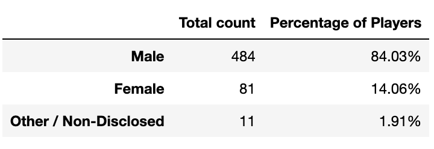
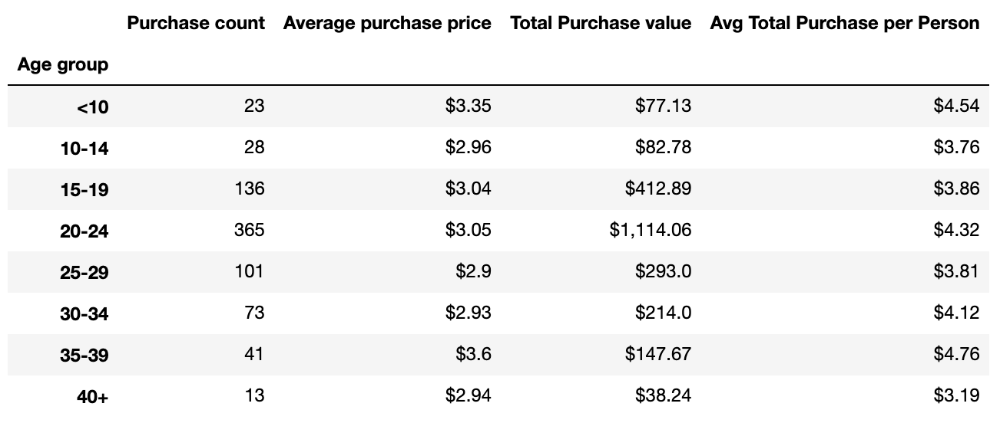
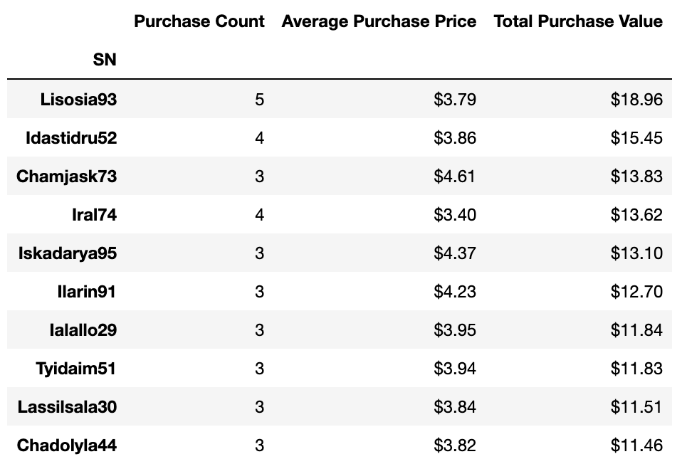
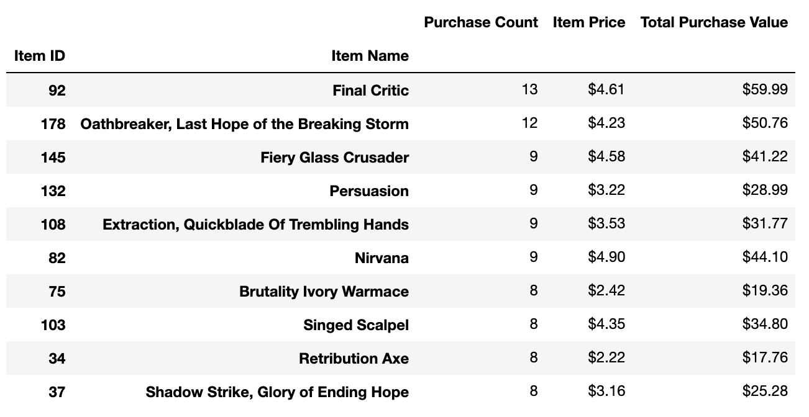

# Pandas Homework - Pandas, Pandas, Pandas

## Heroes of Pymoli

The final report includes each of the following:

### Player Count

* Total Number of Players

### Purchasing Analysis (Total)

* Number of Unique Items
* Average Purchase Price
* Total Number of Purchases
* Total Revenue

### Gender Demographics

* Percentage and Count of Male Players
* Percentage and Count of Female Players
* Percentage and Count of Other / Non-Disclosed

### Purchasing Analysis (Gender)
The below each broken by gender:
  * Purchase Count
  * Average Purchase Price
  * Total Purchase Value
  * Average Purchase Total per Person by Gender

### Age Demographics
The below each broken into bins of 4 years (i.e. &lt;10, 10-14, 15-19, etc.):
  * Purchase Count
  * Average Purchase Price
  * Total Purchase Value
  * Average Purchase Total per Person by Age Group

### Top Spenders
Identify the the top 5 spenders in the game by total purchase value, then list (in a table):
  * SN
  * Purchase Count
  * Average Purchase Price
  * Total Purchase Value

### Most Popular Items
Identify the 5 most popular items by purchase count, then list (in a table):
  * Item ID
  * Item Name
  * Purchase Count
  * Item Price
  * Total Purchase Value
  

### Most Profitable Items
Identify the 5 most profitable items by total purchase value, then list (in a table):
  * Item ID
  * Item Name
  * Purchase Count
  * Item Price
  * Total Purchase Value
 

